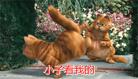

**（一）：写在前面**

这一次进行了一个比较大的迭代，在这里我先把相对于上一个版本的改进做一个解释：

- 1:进一步完善画点，增加了使用字符串代替RGBT值
- 2:实现字符串解析出RGBT值
- 3:增加了画圆的算法
- 4:进一步增强了代码注释

这四个点是这一节实现的主要内容．这样的修改为下面进一步的实现提供了方便．

**（二）：功能介绍**

首先我做的是把颜色相关的代码单独分离开来，新增加一个color.h文件，专用于颜色相关的操作和属性表示．下面就是对画点，画线，和画圆的进一步增强．

*１：画点的进一步增强*

在画点的时候，之前都是使用结构体POINT来代替点的位置，但是，平时我们在使用的时候，比较方便的就是直接指定点的x,y值，所以，我首先增加了指定点的x,y值来画点．

```
/*
 * 该函数用于指定点的横坐标，纵坐标的值来画点
 * @param pFbdev 	参考结构体 fbdev
 * @param x 		点的坐标对应的横坐标的值
 * @param y			点的坐标对应的纵坐标的值
 * @param r			颜色对应的R值 
　* @param g			颜色对应的G值
 *　@param b			颜色对应的B值
 */
void draw_x_y_dot(PFBDEV pFbdev,int x,int y,uint8_t r,uint8_t g,uint8_t b);

```

另一方面，之前无论是在画点，画线还是画其他形状的时候，我们都仅仅是指定他们颜色的RGB值，但是没有对透明度的指定，所以，在这里，我又新增了一个指定透明度来画点的实现．

```
/*
 * 该函数用于实现画点，不过在这个函数中需要设定透明度参数
 * @param pFbdev 	参考结构体 fbdev
 * @param p 		点的坐标
 * @param r			颜色对应的R值
　* @param g			颜色对应的G值
 *　@param b			颜色对应的B值
　* @param t			颜色对应的透明度值
 *　@return void
 */
void draw_dot_with_trans(PFBDEV pFbdev,POINT p,uint8_t r,uint8_t g,uint8_t b,uint8_t t);

```

还有就是把指定透明度和指定x,y值相结合实现一个画点的函数实现．

```
/*
 * 该函数用于指定点的横坐标，纵坐标的值，并且必须指明透明度来画点
 * @param pFbdev 	参考结构体 fbdev
 * @param x 		点的坐标对应的横坐标的值
 * @param y			点的坐标对应的纵坐标的值
 * @param r			颜色对应的R值 
 * @param g			颜色对应的G值
 * @param b			颜色对应的B值
 * @param t			颜色对应的透明度值
 */
void draw_x_y_dot_with_trans(PFBDEV pFbdev,int x,int y,uint8_t r,uint8_t g,uint8_t b,uint8_t t);

```

后面又增加了一些别的画点的函数，包括在RGBT结构体中指定透明度啊等等函数．这里不再赘余．

*2：字符串代表颜色*

在我们的程序中，我们可以知道，无论是颜色的RGBT值，都是使用uint8_t作为其类型的．也就是8为的正整形数字．我们可以使用两个16进制数来表示8位，例如0xff，转换成二进制数就是11111111．这样就能代表颜色了．对于RGBT都是这样表示，所以，我们使用"FFFFFFFF"来表示RGBT很合适．

下面这个代码是我将字符串转换成RGBT的算法，这个算法现在我感觉很不好，后期还需要修改．

```
RGBT getRGBT(const char *temp){
	RGBT rgbt;	

	char *c_tmp;
	c_tmp = (char *)malloc(4 * sizeof(int));

	c_tmp[0] = '0';
	c_tmp[1] = 'x';
	int r,g,b,t;

	//RGBT值的计算
	c_tmp[2] = temp[0];
	c_tmp[3] = temp[1];
	
	r = strtol(c_tmp,NULL,16);
	
	c_tmp[2] = temp[2];
	c_tmp[3] = temp[3];
	
	g = strtol(c_tmp,NULL,16);

	c_tmp[2] = temp[4];
	c_tmp[3] = temp[5];
	
	b = strtol(c_tmp,NULL,16);
	
	c_tmp[2] = temp[6];
	c_tmp[3] = temp[7];
	
	t = strtol(c_tmp,NULL,16);

	rgbt.r = r;
	rgbt.g = g;
	rgbt.b = b;
	rgbt.t = t;

	return rgbt;
}

```

这样，以后就可以方便的时候字符串来代替RGBT值了．

*３：画圆的实现*

画圆的实现比较简单，就是使用方程式:
$$(x-a)^2 + (y-b)^2 = c^2$$

这样，我们已经知道圆的中心点(a,b)，还有圆的半径R了．那么我们就可以使用上面的公式将圆画出来．

```
//画圆
void draw_circle(PFBDEV pFbdev,int x,int y,int radius,const char *color)
{
	double i;
	
	int tmp;

	for(i = x - radius; i < x + radius;i+=0.01){
		tmp = sqrt(radius * radius - (i - x) * (i - x));
		
		draw_x_y_color_dot_with_string(pFbdev,i,(tmp + y),color);
		draw_x_y_color_dot_with_string(pFbdev,i,(-tmp + y),color);
	}
}

```

注意　i+= 0.01 这个地方，如果将0.01换成别的，会有不一样的效果，大家如果有兴趣可以尝试一下．

**（三）：后期规划**

在后面的时候，我们将画点，画线，画各种图形分开来，正确实现一个在命令行界面下的一个小型的图形库．主要是为了好玩，有趣．

**（四）：写在后面**

生活的乐趣就是充满了很多不定因素．




